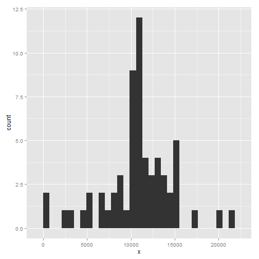

# Reproducible Research: Peer Assessment 1


## Loading and preprocessing the data

This is the dataset for prossesing. It contains personal info on daily/interval activity (steps walked) for an individual that collected it with a device.
The analysis will consist of some simple summaries and plots to better describe and have a picture of the activity load for this individual.
Let's load the dataset which should be located in somewhere in the file system.
For loading from a different dir structure, just change the file variable with whatever path you want. 
The rest of the code should work out of the box, only if you have installed the requiered R packages:

1. ggplot2 (for plotting)
2. plyr (for transforming datasets)

If you dont have the installed just run this commnads:

* install.packages(ggplot2)
* install.packages(plyr)

and you are done.

Load dataset:


```r
file = "C:/Users/nachhh/coursera-R/rep-data/peer1/activity.csv"
activityCSV = read.csv(file, sep=",", header=T)
```
I'm going to transform this dataset on the fly in each part of the analysis. So let's start.

## What is mean total number of steps taken per day?

We are going to use the ggplot2 library for doing the plots.
So lets import it fisrt:


```r
library(ggplot2)
```

Now we calculate total steps per day and put this data in a new table (we just take the column that we are concerned here (2) which as the sum of all steps for each individual day)


```r
stepsPerDay = aggregate(activityCSV$steps, 
  by=list(activityCSV$date), FUN=sum)[2]
```
And we are going to clean this dataset and remove the missing data (NA's):


```r
stepsPerDayClean = na.omit(stepsPerDay)
```

It's time to plot our steps per day with a histogram:


```r
ggplot(stepsPerDayClean, aes(x=x)) + geom_histogram()
```

```
## stat_bin: binwidth defaulted to range/30. Use 'binwidth = x' to adjust this.
```

 

Finally, lets see which is the mean and median for the number of steps per day, for all days in the original dataset:


```r
meanStepsPerDay = mean(stepsPerDayClean$x)

medStepsPerDay = median(stepsPerDayClean$x)
```

So we are done with the first part of the analysis where we have calculated the total number of steps per day, its mean and median over all distinct days and drown a quick and dirty histogram to see how does our data looks like. Specifically we can see in the plot  
for any specific range of number of steps, the count of days that fall within that range. This is useful to know the frequency of the different loads of body workout.

## What is the average daily activity pattern?

In this part of the analysis, lets see the average number of steps in each 5 minute interval through out the day. For example, in interval 2 (from minute 10 to 15 counting from the begining of the day), for all days meassured, what is the average number of steps?
Let's answer this question.

Fisrt we omit NA's like before but then lets group data by interval (instead of dates):


```r
activityCSVClean = na.omit(activityCSV)

avgStepsPerInterval = aggregate(activityCSVClean$steps, 
  by=list(interval=activityCSVClean$interval), FUN=mean)
```

And lets look at a time series plot for this time serie. 
Note that I don't need to create a time series (ts) object to make the actual plot. With the plot function and the argument type=1 is enough for generating the plot:


```r
plot(avgStepsPerInterval$x,type="l")
```

 

And finally, from avgStepsPerInterval dataset we can calculate the interval that contains the maximun number of steps:


```r
avgStepsPerInterval[max(avgStepsPerInterval$x),]
```

```
##     interval    x
## 206     1705 56.3
```

## Imputing missing values

Now I'm going to see what happens with all my previous analysis if I fill the missing values with some data. I want to check if the summaries and plots change significantly by filling NA's.

My strategy is to fill NA's with the average number of steps per interval, as this seems to be a very simple method to start with.
From the results I will evaluate if the method isn't adecuate and find out another, possibly more complex method for filling NA's.

Fisrt I'm importing plyr package as I'm going to use it to transform data:


```r
require(plyr)
```

```
## Loading required package: plyr
```
First let's have an idea of the total number of NA's (missing values) in our original dataset. If its "huge" then this is a potential problem. Else we should be ok by filling NA's with any reasonable method.


```r
length(which(is.na(activityCSV$steps)))
```

```
## [1] 2304
```

This shows that a couple of days have been "workout day's off" 

Ok, let's fill the missing values.
Note that mean(avgStepsPerInterval$x) is the same as meanStepsPerDay/288, so I'm using this second formula as the filler value.


```r
meanStepsByDay = function(x) {
  replace(x, is.na(x), meanStepsPerDay/288)
}

activityTableFilledNA = ddply(activityCSV, ~ date, transform, steps = meanStepsByDay(steps))
```

Now we recalculate the mean median and histogram with NA's filled
with avg steps per interval:


```r
stepsPerDay2 = aggregate(activityTableFilledNA$steps, 
  by=list(activityTableFilledNA$date), FUN=sum)[2]

ggplot(stepsPerDay2, aes(x=x)) + geom_histogram()
```

```
## stat_bin: binwidth defaulted to range/30. Use 'binwidth = x' to adjust this.
```

 

```r
meanStepsPerDay2 = mean(stepsPerDay2$x)
medStepsPerDay2 = median(stepsPerDay2$x)
```

As we can see, the mean has not changed at all. Only the median has slightly increased.

## Are there differences in activity patterns between weekdays and weekends?
